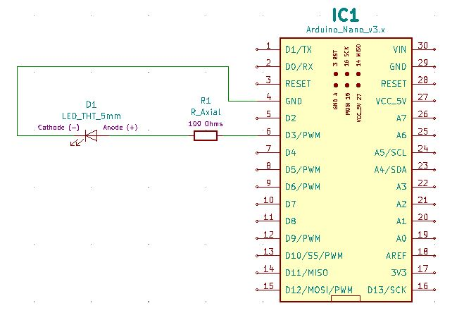
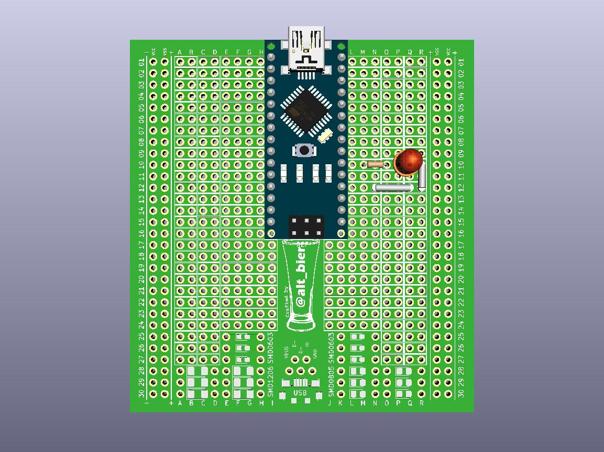
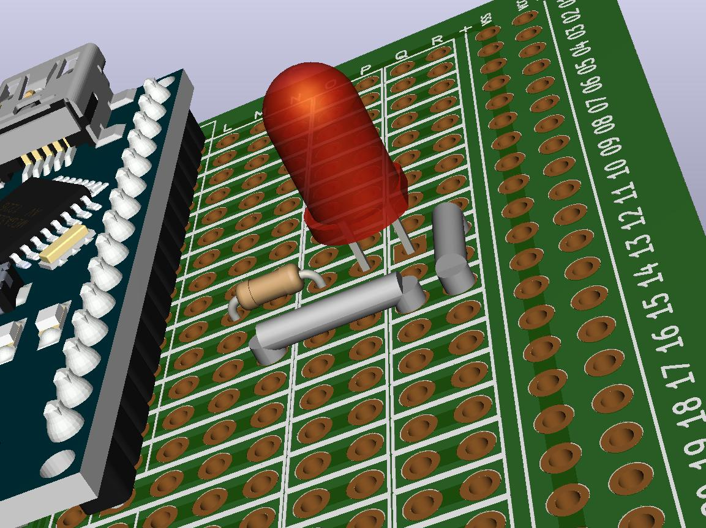

# HHV2020_01

This is HHV Lab 01.

This is part of the HHV video presentation "Arduino Basics" found on the [alt_bier_hacker YouTube channel](https://www.youtube.com/channel/UC986BzRchhp4fKb9zLjqvUA/).

In this Lab you will connect a single LED to a digital pin on the Arduino Nano that supports PWM (Pulse Width Modulation) and program it to fade and step through various values which affect the LED's brightness.

Anyone who has played with an Arduino before has probably set up a similar circuit to "Blink" and LED on and off.
There are many tutorials online instructing how to accomplish this.
I wanted to take this simple setup one step further by showing how PWM allows for simulated analog signaling on a digital pin.

## Schematic

Here is a schematic of the circuit you will build for this Lab.

## Component Layout

You can build this circuit on a solderless breadboard.
But, for the Lab we will be soldering it to the custom PCB strip board provided in the HHV kit.

I have laid out the component placement using the custom PCB strip board.
It does not use the power rails as I am reserving those for powering the Arduino or Trinket via battery.
This is the component layout I have used:

* Resistor in M10 and O10
* LED Anode in P10 and Cathode in Q10
* Jumper Wire(s) between R10 and N12

Here are images of the component layout I have used.

## Arduino Code

I developed Arduino code for two different methods of controlling the LED using analog signals.

* The first named Arduino_Nano_Single_LED_w_PWM_Fade will fade the LED between fully off and fully on including every state in between.
* The second named Arduino_Nano_Single_LED_w_PWM_Step will step the LED between fully off and fully on using predefined value increments.

This code is available in the [code section of this repository](/code/HHV2020_01/).
