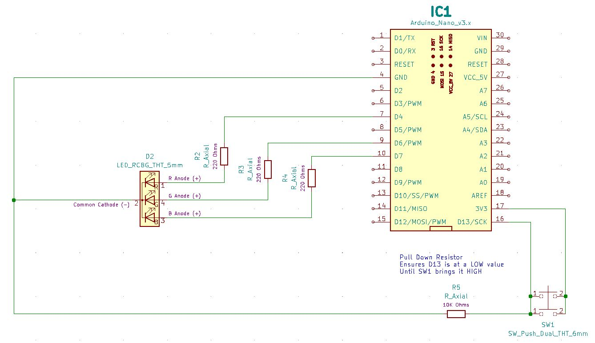
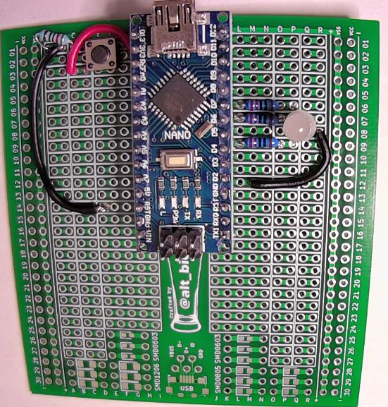
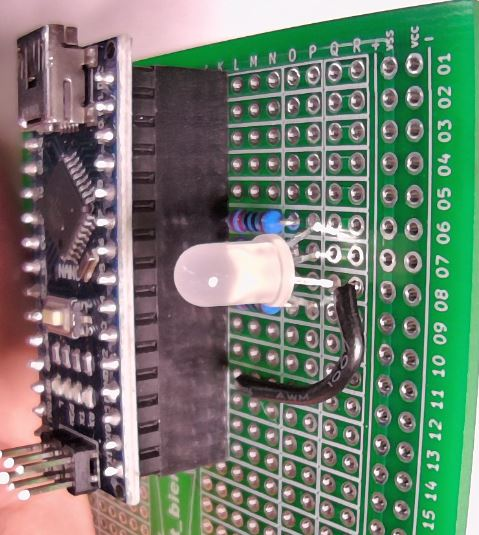
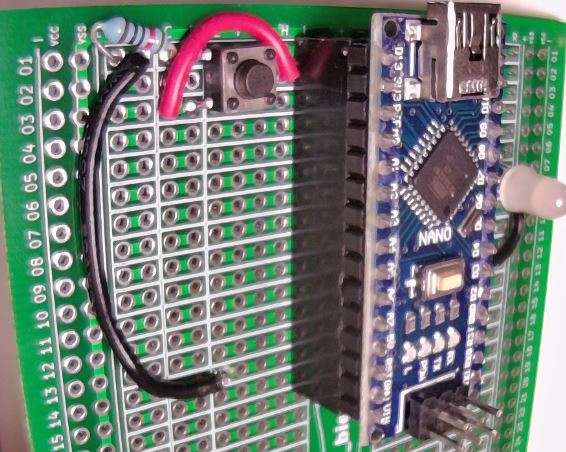

# HHV2020_02

This is HHV Lab 02.

This is part of the HHV video presentation "Arduino Development for Beginners" found on the [alt_bier_hacker YouTube channel](https://www.youtube.com/channel/UC986BzRchhp4fKb9zLjqvUA/).

In this Lab you will connect an RGB Common Cathode LED and a Tactile Switch to the Arduino Nano and program it to cycle through colors and read from the button to make color changes.

## Schematic

Here is a schematic of the circuit you will build for this Lab.

## Component Layout

You can build this circuit on a solderless breadboard.
But, for the Lab we will be soldering it to the custom PCB strip board provided in the HHV kit.

I have laid out the component placement using the custom PCB strip board.
It does not use the power rails as I am reserving those for now.

This is the component layout I have used:

* Arduino Nano: I1-15 and K1-15
* Resistor 220 Ohm: L9 and O9
* Resistor 220 Ohm: L7 and O7
* Resistor 220 Ohm: L6 and O6
* RGB CC LED: P9 (R-Anode), Q8 (Cathode), P7 (G-Anode), and P6 (B-Anode)
* Jumper Wire: R8 and M12
* Switch SPST 4-pin: D1 (A), G1 (B), D3 (C), and break off pin D from SW to prevent a short
* Resistor 10K Ohm: C1 and A1
* Jumper Wire: H2 and C3
* Jumper Wire: B1 and E14

Here are images of the component layout I have used.

## Arduino Code

This lab will walk through several pieces of code designed to work with the circuit above.

* Arduino_Nano_RGB_LED_Cycle
    * This code will make the RGB LED cycle through various color combinations.
* Arduino_Nano_RGB_LED_w_Tactile_Switch
    * This code will make the RGB LED change color when the button is pressed.

This code is available in the [code section of this repository](/code/HHV2020_02/).
