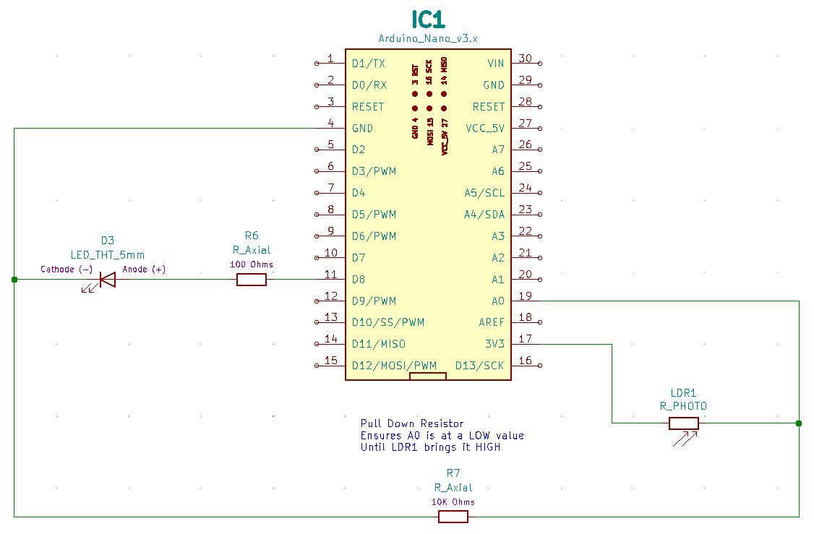

# HHV2020_03

This is HHV Lab 03.

This is part of the HHV video presentation "Arduino Development for Beginners" found on the [alt_bier_hacker YouTube channel](https://www.youtube.com/channel/UC986BzRchhp4fKb9zLjqvUA/).

In this Lab you will connect a Photoresistor and an LED to the Arduino Nano.
Program the Arduino to light the LED based on the values from the Photoresistor.
Read the Photoresistor values and convert them to luminosity values displayed in lumens.

## Schematic

Here is a schematic of the circuit you will build for this Lab.

## Component Layout

You can build this circuit on a solderless breadboard.
But, for the Lab we will be soldering it to the custom PCB strip board provided in the HHV kit.

I have laid out the component placement using the custom PCB strip board.
It does not use the power rails as I am reserving those for powering the Arduino or Trinket via battery.
This is the component layout I have used:

* TBD

Here are images of the component layout I have used.

## Arduino Code

I developed Arduino code for controlling the RGB LED by reading a signal from the Tactile Switch and changing the color displayed when pushed.

* The code file is named Arduino_Nano_RGB_LED_w_Tactile_Switch.

This code is available in the [code section of this repository](/code/HHV2020_03/).
