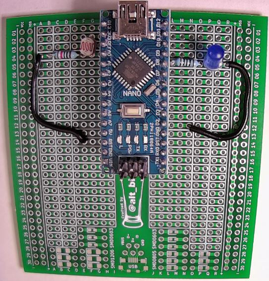
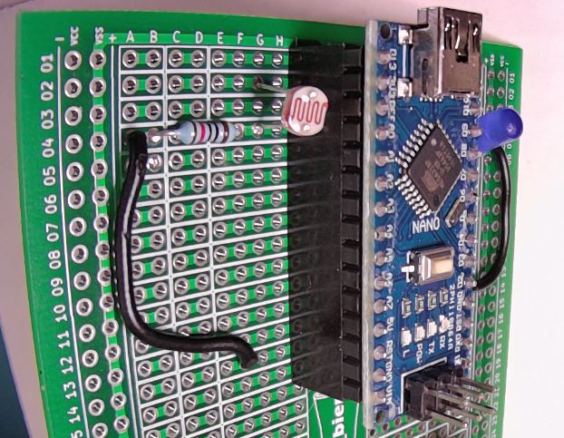
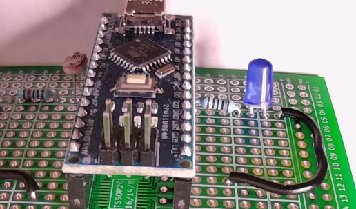

# HHV2020_03

This is HHV Lab 03.

This is part of the HHV video presentation "Arduino Development for Beginners" found on the [alt_bier_hacker YouTube channel](https://www.youtube.com/channel/UC986BzRchhp4fKb9zLjqvUA/).

In this Lab you will connect a Photoresistor and an LED to the Arduino Nano.
Program the Arduino to light the LED based on the values from the Photoresistor.
Read the Photoresistor values and convert them to luminosity values displayed in lumens.

## Schematic

Here is a schematic of the circuit you will build for this Lab.

## Component Layout

You can build this circuit on a solderless breadboard.
But, for the Lab we will be soldering it to the custom PCB strip board provided in the HHV kit.

I have laid out the component placement using the custom PCB strip board.
It does not use the power rails as I am reserving those for now.
This is the component layout I have used:

* Arduino Nano: I1-15 and K1-15
* Resistor 100 Ohm: L5 and O5
* LED: P5 (Anode) and Q5 (Cathode)
* Jumper Wire: R5 and N12
* Photoresistor: G2 and G4
* Resistor 10K Ohm: B4 and F4
* Jumper Wire: A4 and F14

Here are images of the component layout I have used.

## Arduino Code

This lab will walk through several pieces of code designed to work with the circuit above.

* Arduino_Nano_Photoresistor_LED_Control
    * This code will use the values read from the photoresistor to control the state of an LED turning it on in dark and off in light conditions.
* Arduino_Nano_Photoresistor_Luminosity
    * This code will read the raw photoresistor values and convert them to luminosity values in lumens.

This code is available in the [code section of this repository](/code/HHV2020_03/).
