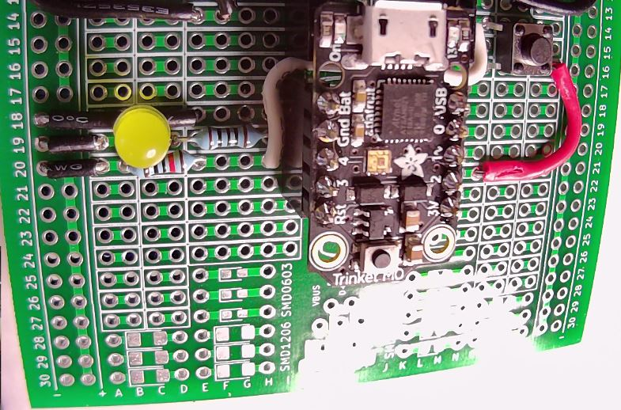

# HHV2020_04

This is HHV Lab 04.

This is part of the HHV video presentation "Learn CircuitPython using the Adafruit Trinket M0" found on the [alt_bier_hacker YouTube channel](https://www.youtube.com/channel/UC986BzRchhp4fKb9zLjqvUA/).

In this Lab you will learn about CircuitPython and the Adafruit Trinket M0 by controlling a simple circuit with an LED and a Tactile switch.
You will use CircuitPython code to control an LED on the trinket and an external LED and switch using digital and PWM signals.

## Schematic

Here is a schematic of the circuit you will build for this Lab.

## Component Layout

You can build this circuit on a solderless breadboard.
But, for the Lab we will be soldering it to the custom PCB strip board provided in the HHV kit.

I have laid out the component placement using the custom PCB strip board.
This is the component layout I have used:

* Trinket: I17-21 and J17-21
* Resistor 100 Ohm: D19 and H19
* LED:C19 (Anode) and B19 (Cathode)
* Jumper Wire: A19 and VCC19
* Jumper Wire: E18 and VCC18
* Switch SPST 4 Pin: N14 (A), Q14 (B), N16 (C), and Q16 (D)
* Jumper Wire: R16 and N21
* Jumper Wire: M14 and H20
* Resistor 10K Ohm: E20 and B20
* Jumper Wire: A20 and VCC20

Here are images of the component layout I have used.

## Arduino Code

This lab will walk through several pieces of code designed to work with the circuit above.

* Adafruit_Trinket_Blink_Internal_LED
    * This code will blink the on-board Red LED on and off.
* Adafruit_Trinket_Blink_LEDs
    * This code will blink the on-board and external LEDs on and off.
* Adafruit_Trinket_Fade_LED
    * This code will fade an external LED on and off using PWM (Pulse Width Modulation).
* Adafruit_Trinket_Tactile_Switch_LED_Control
    * This code will read a Tactile Switch (Button) and use those results to control an LED turning it on when pressed.

This code is available in the [code section of this repository](/code/HHV2020_04/).
