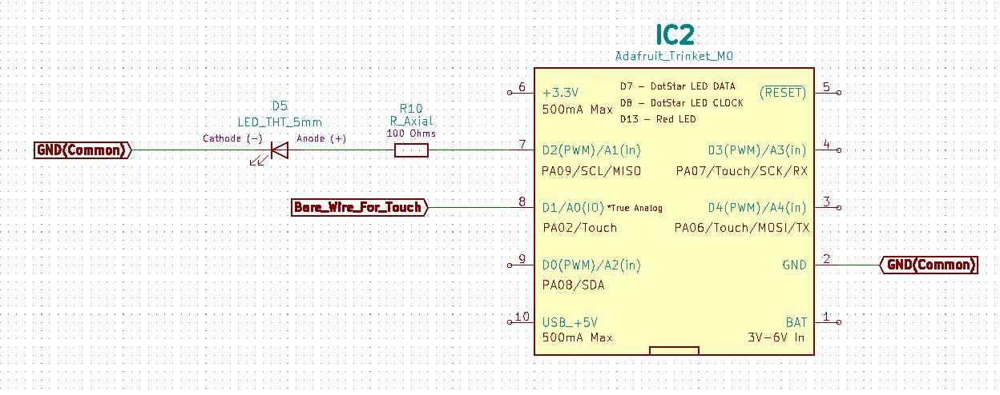
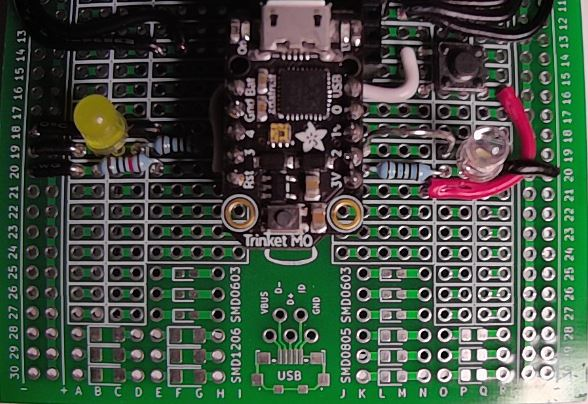
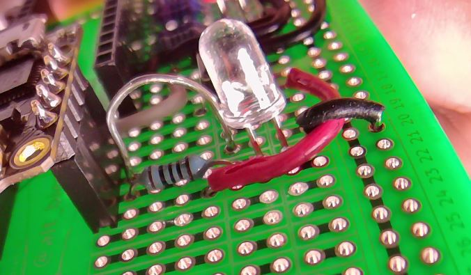

# HHV2020_05

This is HHV Lab 05.

This is part of the HHV video presentation "Learn CircuitPython using the Adafruit Trinket M0" found on the [alt_bier_hacker YouTube channel](https://www.youtube.com/channel/UC986BzRchhp4fKb9zLjqvUA/).

In this Lab you will learn about CircuitPython and the Adafruit Trinket M0 by working with the on-board DotStar RGB LED, an external LED, and touch sensor control.

## Schematic

Here is a schematic of the circuit you will build for this Lab.

## Component Layout

You can build this circuit on a solderless breadboard.
But, for the Lab we will be soldering it to the custom PCB strip board provided in the HHV kit.

I have laid out the component placement using the custom PCB strip board.
This is the component layout I have used:

* Trinket: I17 21 and J17 21
* Resistor 100 Ohm: K20 and O20
* LED:P20 (Anode) and Q20 (Cathode)
* Jumper Wire: R20 and VCC20
* Bare Wire (for touch): K19 and O19

Here are images of the component layout I have used.

## Arduino Code

This lab will walk through several pieces of code designed to work with the circuit above.

* Adafruit_Trinket_Blink_Internal_DotStar_RGB_LED
    * This code will blink the on-board DotStar RGB LED on in each color and then off.
* Adafruit_Trinket_Cycle_Internal_DotStar_RGB_LED
    * This code will color cycle the on-board DotStar RGB LED.
* Adafruit_Trinket_Touch_Control_LED
    * This code will read in values from a touch sensor and use those values to determine when to turn an LED on.
* Adafruit_Trinket_Touch_Cycle_DotStar_RGB_LED
    * This code will read in values from a touch sensor and use those values to determine when to cycle the colors on the DotStar RGB LED.

This code is available in the [code section of this repository](/code/HHV2020_05/).
