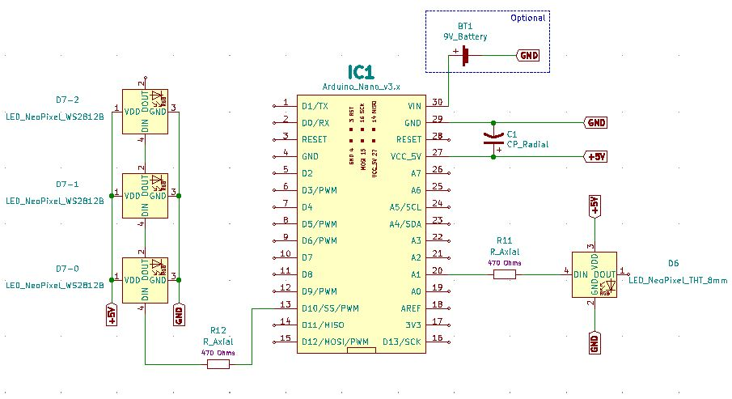
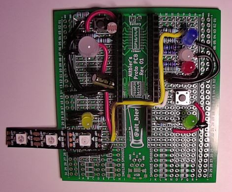
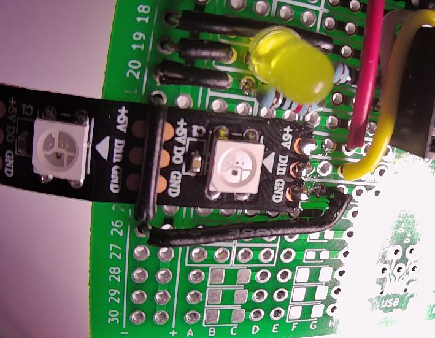
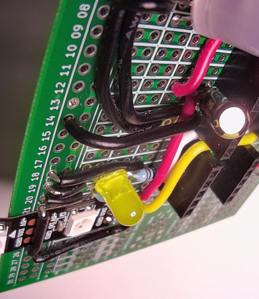
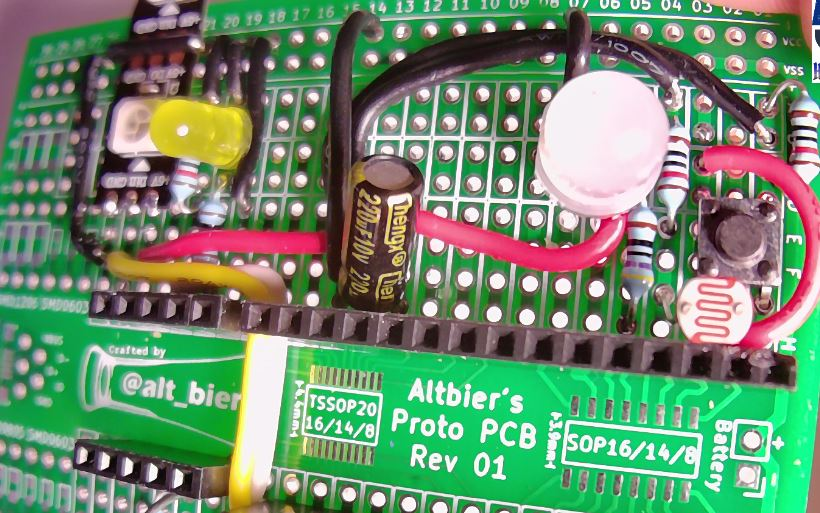
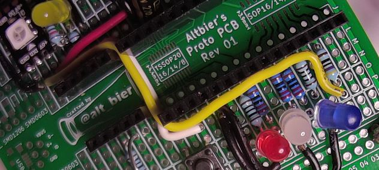
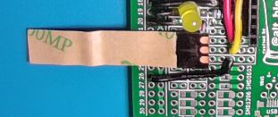
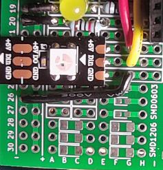
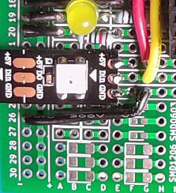
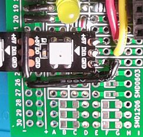

# HHV2020_06

This is HHV Lab 06.

This is part of the HHV video presentation "Working with NeoPixels" found on the [alt_bier_hacker YouTube channel](https://www.youtube.com/channel/UC986BzRchhp4fKb9zLjqvUA/).

In this Lab you will learn about NeoPixels by building a circuit with them and controlling it with an Arduino Nano.

## Schematic

Here is a schematic of the circuit you will build for this Lab.

## Component Layout

You can build this circuit on a solderless breadboard.
But, for the Lab we will be soldering it to the custom PCB strip board provided in the HHV kit.

I have laid out the component placement using the custom PCB strip board.
This is the component layout I have used:

* Nano – I1-15 and K1-15
* Resistor 470 Ohm – L3 and O3
* Resistor 470 Ohm – D5 and H5
* Capacitor 220 uF (Polarized): Anode H12 and Cathode H14
* NeoPixel 8mm THT APA106:
    * Pin 1 (DIN) – C5
    * Pin 2 (VIN) – C6
    * Pin 3 (GND) – B7
    * Pin 4 (DOUT) – C8
* NeoPixel Strip WS2812B
    * Pin 1 (VIN) – E22
    * Pin 2 (DIN) – E23
    * Pin 3 (GND) – E24
* Wire – G14 and VCC14
* Wire – A7 and VCC7
* Wire – G24 and VCC27
* Wire – D6 and E12
* Wire – F12 and G22
* Wire – G23 and P3
* Wire (physical hold down of Strip)– VCC21 and VCC25

Here are images of the component layout I have used.

Here are some images of placement and securing of the Strip.

Removing part of the Strip sticker back

Placement of the Strip on the PCB

Soldering the Strip to the PCB

Securing the Strip with a wire

## Arduino Code

This lab will walk through several pieces of code designed to work with the circuit above.

* Arduino_Nano_Neopixel_Single
    * This code will blink the 8mm NeoPixel LED in various colors.
* Arduino_Nano_Neopixel_Strip
    * This code will blink a strip of NeoPixels in various colors.
* Arduino_Nano_Neopixel_Strip_Cycle
    * This code will cycle the colors on a strip of NeoPixels.

This code is available in the [code section of this repository](/code/HHV2020_06/).
