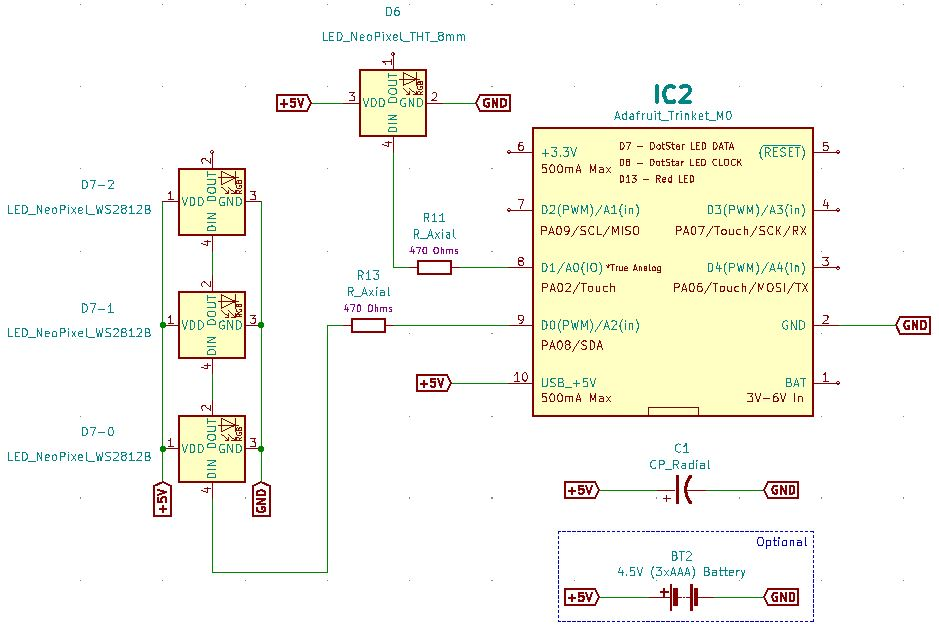
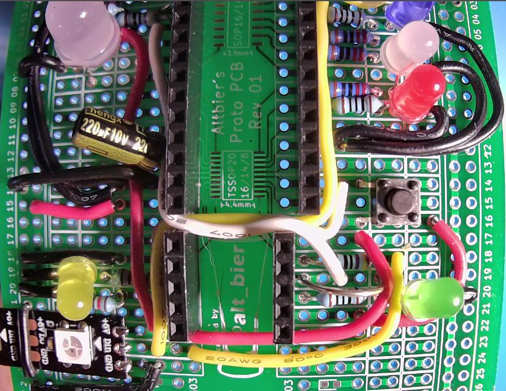

# HHV2020_07

This is HHV Lab 07.

This is part of the HHV video presentation "Working with NeoPixels" found on the [alt_bier_hacker YouTube channel](https://www.youtube.com/channel/UC986BzRchhp4fKb9zLjqvUA/).

In this Lab you will learn about NeoPixels by building a circuit with them and controlling it with CircuitPython on an Adafruit Trinket M0.

## Schematic

Here is a schematic of the circuit you will build for this Lab.

## Component Layout

You can build this circuit on a solderless breadboard.
But, for the Lab we will be soldering it to the custom PCB strip board provided in the HHV kit.

I have laid out the component placement using the custom PCB strip board.
This is the component layout I have used in addition to the components added in Lab 06:

* Trinket – I17-21 and J17-21
* Resistor 470 Ohm – K18 and O18
* Wire – P18 and I23
* Wire – N17 and I22
* Wire – M19 and G5

Note: the components from Lab 06 are required for this lab.  If you did not add those to the PCB you should do that before proceding here.

Here is an image of the final component layout.

## CircuitPython Code

This lab will walk through several pieces of code designed to work with the circuit above.

* Adafruit_Trinket_Neopixel_Single
    * This code will blink the 8mm NeoPixel LED red on and off.
* Adafruit_Trinket_Neopixel_Strip
    * This code will blink a strip of NeoPixels in various colors.
* Adafruit_Trinket_Neopixel_Strip_Cycle
    * This code will cycle the colors on a strip of NeoPixels.

This code is available in the [code section of this repository](/code/HHV2020_07/).
