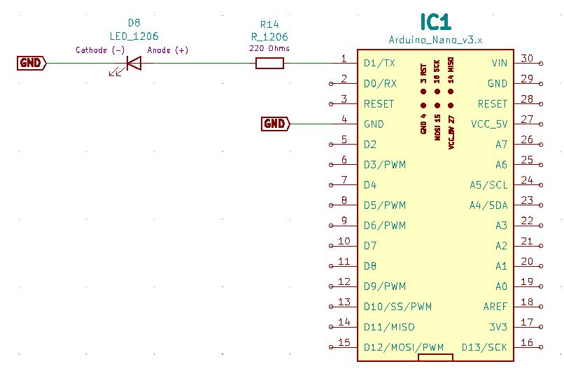
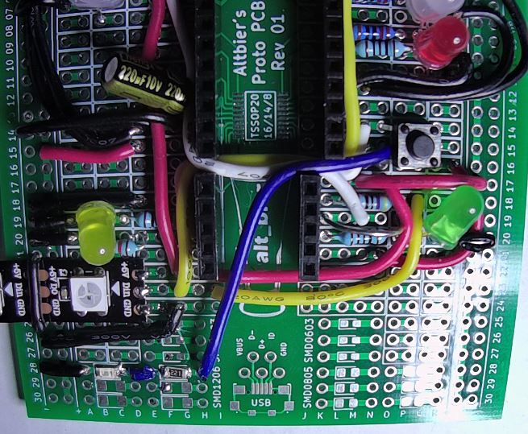
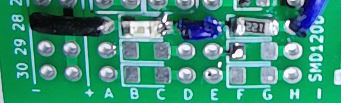

# HHV2020_08

This is HHV Lab 08.

This is part of the HHV video presentation "Working with Surface-Mount Technology" found on the [alt_bier_hacker YouTube channel](https://www.youtube.com/channel/UC986BzRchhp4fKb9zLjqvUA/).

In this Lab you will learn about Surface-Mount Technology components by building a circuit with them and controlling it with an Arduino Nano.
We will show how to use traditional soldering techniques on an SMD as well as reflow techniques using a hot air rework tool.

## Schematic

Here is a schematic of the circuit you will build for this Lab.

## Component Layout

You can build this circuit on a solderless breadboard.
But, for the Lab we will be soldering it to the custom PCB strip board provided in the HHV kit.

I have laid out the component placement using the custom PCB strip board.
This is the component layout I have used:

* Nano – I1-15 and K1-15
* Resistor 220 Ohm 1206 – G28 and F28
* LED 1206 – C28 (Anode) and B28 (Cathode)
* Wire – N15 and H28
* Wire – E28 and D28
* Wire – A28 and VCC28

Here are images of the final component layout.

## Arduino Code

This lab is focused on the physical aspects of working with SMT.
As such the code we will use is a simple LED blink example to test our SMD are working as expected.

* Arduino_Nano_SMD_LED_Blink
    * This code will blink the SMD LED on and off.

This code is available in the [code section of this repository](/code/HHV2020_08/).
